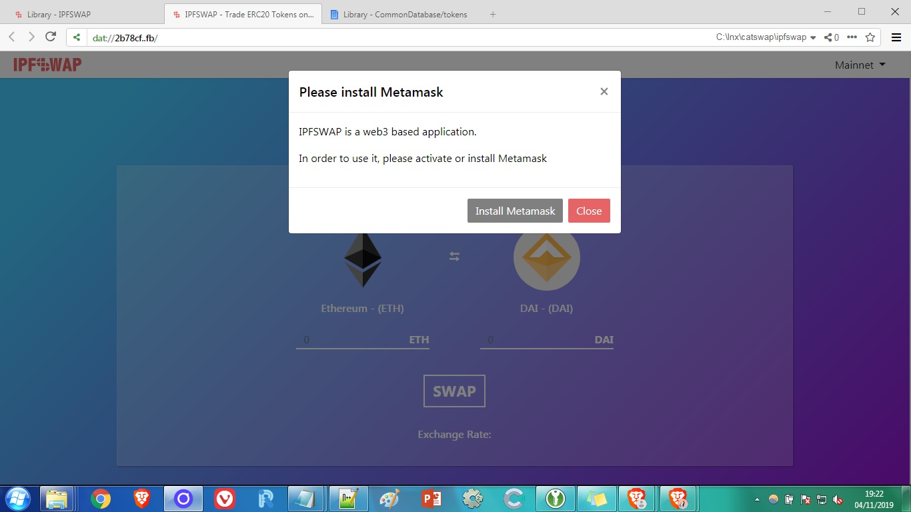

# ipfswap

Fully trustless ERC20 Token Swaps using Ethereum &amp; Kyber Network, hosted on IPFS.

IPFS address: [QmXJSK7VaNoAmZr4Fp7Z5faqNSnxGpMs3ENfPhncnQ7ag2](https://gateway.pinata.cloud/ipfs/QmXJSK7VaNoAmZr4Fp7Z5faqNSnxGpMs3ENfPhncnQ7ag2/)

Site domain: https://ipfswap.com

----

**It also works in Dat network**! Unfortunately, Beaker Browser doesn't haves Web3 integrated, but a fork could implement it using [Muon+MetaMask](https://github.com/SwapyNetwork/electron-metamask-boilerplate). IPFSWAP working from Dat:

Dat gateway address: [https://swap.hashbase.io/](https://swap.hashbase.io/)

Dat address: dat://2b78cfdb34d9fcaced2aa8f2b4403366f7d4e63b3530d1362f3e8959dacfb2fb/

